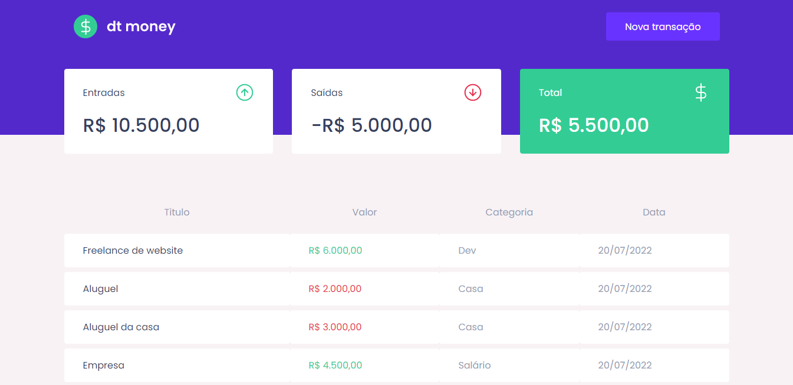
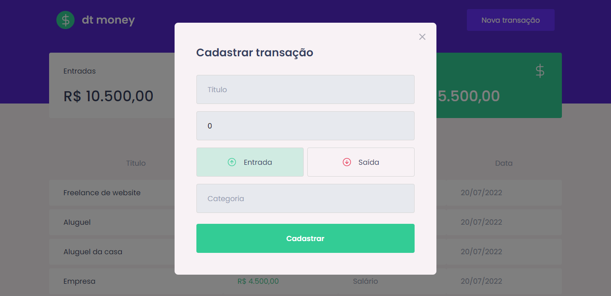

# DT Money - RocketSeat 




>  Aplicação com React completa utilizando conceitos fundamentais e ferramentas muito importantes do ecossistema React, como Styled Components, MirageJS, ContextAPI, Hooks, Componetização, Axios e muito mais!

Confira a aplicação: https://dtmoney-jg.netlify.app/ <br>

## :page_facing_up: Explicação

O projeto consiste numa dashboard onde o usuário pode cadastrar transações financeiras. 
Exemplo: cadastrar uma entrada com valor de R$ 6000,00 na categoria de Salário na data 20/07/2022. Ou então cadastrar a saída.
O total das entradas e saídas é mostrada em 3 cards: "Entradas", "Saídas" e "Total".

## 📁 Componentes

**Dashboard:** </br>
**Header:**  </br>
**NewTransactionModal:** </br>
**Summary:** </br>
**TransactionTable:** </br>
 
## :dart: Etapas ##

O projeto foi concluído.

- [x] Entendendo projeto e instalando dependências
- [x] Criação dos componentes Header, Summary e TransactionTable
- [x] Consumo da API do MirageJS com Axios
- [x] Configuração modal de criação
- [x] Criação do componente NewTransactionModal
- [x] Estilização e lógica de funcionamento dos modais
- [x] Inserção da transação na API
- [x] Listagem das transações
- [x] Formatação de valores após concluir cadastro de transação
- [x] Criação do contexto de transações
- [x] Carregamento de transações
- [x] Soma das entradas e saídas para calculo do total de saldo
- [x] Hook para o contexto da aplicação

## :rocket: Tecnologias ##

No projeto foram utilizadas as seguintes tecnologias:

- [ReactJs](https://pt-br.reactjs.org/)
- [TypeScript](https://www.typescriptlang.org/)
- [Styled-Components](https://www.styled-components.com/)
- [React Icons](https://react-icons.github.io/react-icons/)
- [MirageJS](https://miragejs.com/)
- [Polished](https://polished.js.org/)
- [React Modal](https://www.npmjs.com/package/react-modal)
- [Axios](https://www.npmjs.com/package/axios)
- [Vite](https://vitejs.dev/)
- [ContextAPI](https://pt-br.reactjs.org/docs/context.html)

## :closed_book: Requisitos ##

Antes de iniciar :checkered_flag:, você precisa ter [Git](https://git-scm.com) e [Node](https://nodejs.org/en/) instalados.

## :checkered_flag: Começando ##

```bash
# Clone this project
$ git clone https://github.com/jguilhermesl/jg-money
# Access
$ cd jg-money
# Install dependencies
$ yarn or npm 
# Run the project
$ yarn start or npm start 
# The server will initialize in the <http://localhost:3000>
```
## 🤝 Colaboradores

Agradecemos às seguintes pessoas que contribuíram para este projeto:

<table>
  <tr>
    <td align="center">
      <a href="#">
        <br>
          <sub>
            <b>João Guilherme</b>
          </sub>
        </a>
      </td>
  </tr>
</table>

<a href="#top">Volte para o topo</a>